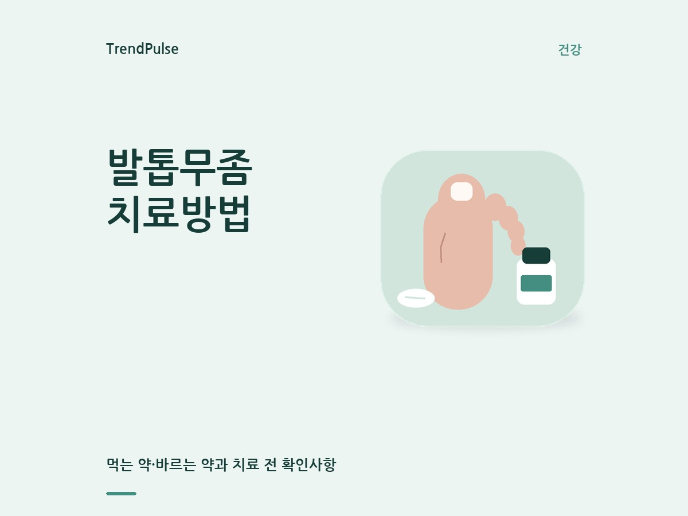
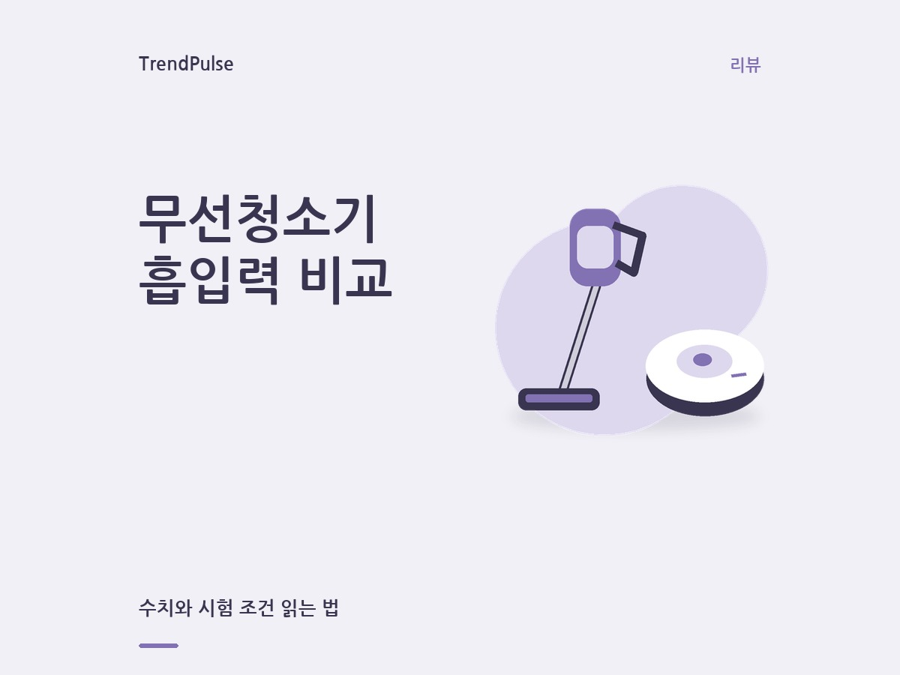
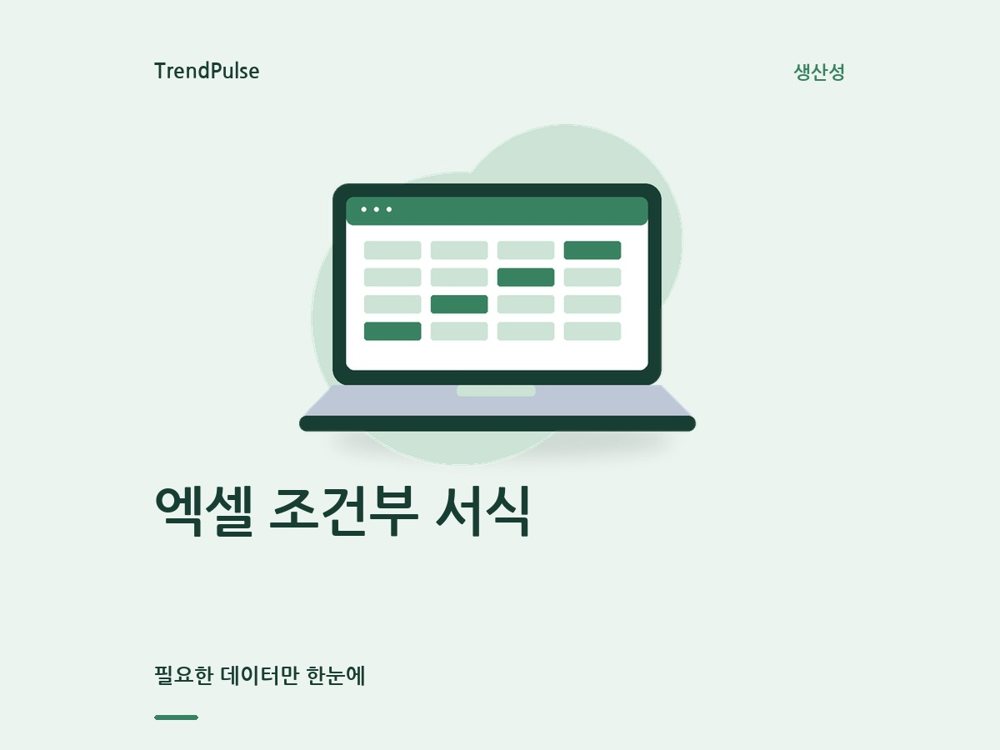
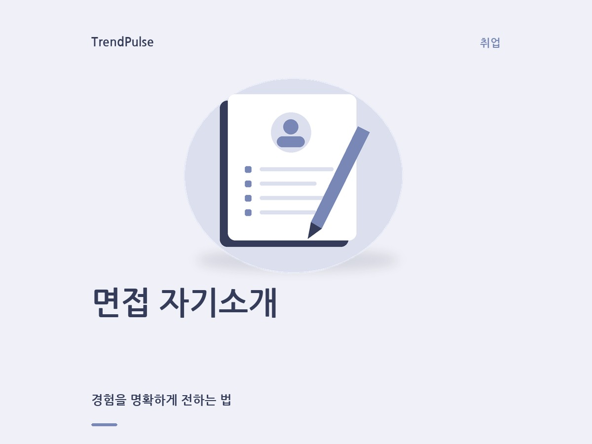
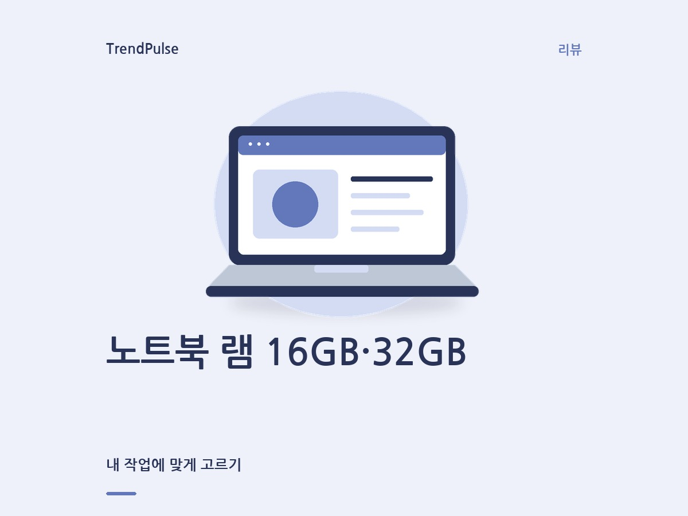
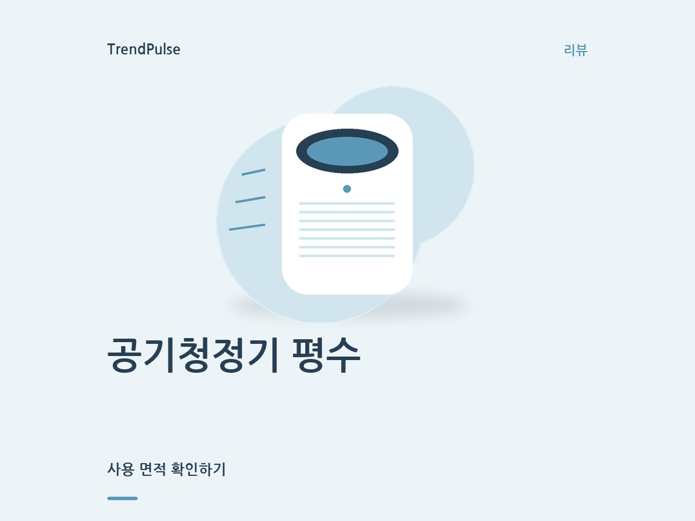

# 주제 일러스트 썸네일과 리뷰 후보 개선

## 썸네일

텍스트만 바뀌던 단일 진녹색 카드 대신 글 주제를 나타내는 자체 일러스트를 렌더링한다.
청소기, 공기청정기, 노트북, 엑셀, 발 관리, 면접 등 14개 주제를 구분하며 색상·배경 형태·배치를 달리한다.
부드러운 배경색과 큰 제목, 충분한 여백을 사용한다. 실제 제품 사진·사용 경험·치료 결과로 오인할 표현은 만들지 않는다.
같은 주제 안에서는 그림을 재사용할 수 있으며 모든 글에 고유한 실사 이미지를 생성하는 방식은 아니다.

제목의 콜론 앞부분을 헤드라인, 뒷부분을 설명으로 사용한다. 콜론이 없으면 본문 소제목 하나를 설명으로 사용한다.
문구는 원문에서 가져오고 긴 설명만 줄인다. 제목 내 일부 붙여 쓴 ‘치료방법’ 등은 공백만 보정한다.
1200×900 원본과 정사각형 중앙 크롭에서 제목이 잘리지 않는지 검사한다.
본문·제목·카테고리·디자인 버전이 파일 이름의 해시에 들어가므로 이전 이미지 캐시를 재사용하지 않는다.
WordPress 미디어 업로드 경로는 동일하며 새 일반 글 생성부터 적용된다. 기존 공개 글을 자동 변경하지 않는다.

검토용 예시이며 아래의 리뷰 주제가 실제 검색 수요·발행 검증을 통과했다는 의미는 아니다.

| 건강 | 리뷰 | 생산성 |
|---|---|---|
|  |  |  |
|  |  |  |

재현: `python scripts/preview_editorial_thumbnails.py --output docs/thumbnail-previews`
각 JPG 옆 JSON에 사용한 제목·소제목·디자인·본문 해시를 기록한다.

## 리뷰 선정 실패의 입력 경로

2026-09-29 실행 36511132430은 20건을 조사했으나 발행 가능 후보를 찾지 못했다.
이전 실패 7건의 재선정 방지는 작동했다. 그러나 빈 모델 제안을 상위 실측 검색어로 채운 경로에서
‘미세먼지’, ‘청소기’, ‘캠핑용품’ 같은 후보가 재등장했다. 출처도 공식 도메인이면 먼저 수집해
고장 해결·스피커 도움말·인증 목록 등이 제한된 출처 자리를 차지했다.

변경 사항:

- 리뷰 수요 수집 시드를 흡입력·사용 면적·메모리·문턱처럼 구매 판단 항목으로 전환한다.
- 실측 응답의 검색어 자체에 제품군과 구체적인 판단 항목이 함께 있어야 조사한다.
  제품군만 있거나 청소·수리 질문이면 `discovery_rejections`에 제외 이유를 남긴다.
  이 어휘 검사는 조사 입력을 거르는 장치이며 의미·근거 승인 장치가 아니다.
- 빈 제안에 강제 후보를 넣지 않고 다음 미제안 구간으로 이동한다.
- 구매 자료 탐색은 삼성 국내 `/sec/`, LG 국내 `/kr/`, 소비자원으로 한정해 사양 자료를 찾는다.
  최대 12개 주소를 제조사별로 교차 확인해 무관한 초기 페이지 때문에 후속 자료가 가려지지 않게 한다.
- 실제로 읽은 본문에서 제품과 요청한 판단 항목을 확인한 뒤 최대 3개 출처에 포함한다.
  고장 해결·인증 목록 등은 제외하고, 별도 웹 연구로 찾은 출처에도 같은 검사를 적용한다.
- 월검색량 하한, 원문 검색어 유지, 실패 이력, 검색 표본·기획 범위·최종 발행 검증은 유지한다.

후보가 없으면 진단 보고서를 남기며 발행을 강제하지 않는다. 실제 선정 성공 여부는
운영과 같은 외부 검색·본문 조회 환경에서 별도 확인해야 한다. 새 PR 머지 전까지 운영 미반영이다.

## 검증 기록

- 선정·출처·썸네일·예약·WordPress 관련 회귀 테스트 1,219개 통과.
- 변경한 네 모듈의 측정 커버리지 92.4% (하한 80% 통과).
- 6종 예시 원본을 렌더링해 육안 확인. 14개 주제와 160자 장문 제목의 중앙 크롭 범위 자동 확인.
- 전체 테스트는 8개 실패를 확인한 뒤 기존 통합 테스트의 외부 호출 대기를 중단했다.
  변경 전 checkout에서도 같은 생성기 7개·이미지 기본 설정 1개 실패를 재현했다. 전체 통과로 보고하지 않는다.
- `src/codex_client.py`의 자동화 신뢰 검사는 기본 브랜치에서만 Codex 인증을 허용한다.
  따라서 작업 브랜치에서 실제 검색 인증을 우회하지 않았다. 사용자 승인으로 PR을 반영한 뒤
  `Blog Keyword Select`의 리뷰 조사만 먼저 실행해 신규 실측 후보·최종 선정 결과를 확인해야 한다.
